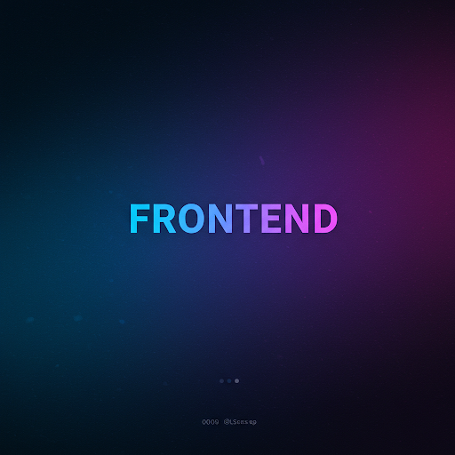

# Tik Tak Toe Javascript

<div align="center">



<div data-badges>
 
 
 
 

</div>

<div data-badges>
 
 
 
</div>

</div> 

## Descrição:

Este projeto é uma implementação clássica do jogo da velha, também conhecido como jogo do galo, construído usando as tecnologias web fundamentais: HTML, CSS e JavaScript. O jogo oferece uma interface interativa onde dois jogadores se revezam para marcar suas posições em um tabuleiro 3x3. O objetivo é alinhar três símbolos iguais (X ou O) na horizontal, vertical ou diagonal para vencer a partida.

## Funcionalidades:

- Interface intuitiva: O jogo apresenta um design limpo e fácil de usar, com um tabuleiro 3x3 claramente visível.
- Jogabilidade: Os jogadores podem clicar nas células do tabuleiro para marcar suas jogadas.
- Lógica de vitória: O jogo verifica automaticamente se um jogador venceu após cada jogada, identificando as combinações vencedoras.
- Empate: O jogo também detecta empates quando todas as células estão preenchidas e nenhum jogador venceu.
- Reiniciar jogo: Um botão de "Reiniciar" permite que os jogadores comecem uma nova partida a qualquer momento.

## Tecnologias utilizadas: 

- HTML: Estrutura a página do jogo, definindo os elementos como o tabuleiro e os botões.
- CSS: Estiliza a página, definindo a aparência do tabuleiro, das células e dos outros elementos visuais.
- JavaScript: Adiciona interatividade ao jogo, implementando a lógica de jogabilidade, a verificação de vitória e a funcionalidade de reiniciar.

## Contribuição:

Contribuições para melhorar o projeto são bem-vindas. Você pode enviar pull requests com correções de bugs, novas funcionalidades ou melhorias de design.

## Como rodar esse projeto

### Execução

1. Clone esse repositório

    ```sh
    git clone https://github.com/Pablo-Sts/tik-tak-toe_javascript
    ```

2. Acesse o diretório do projeto: 

    ```sh
    cd tik-tak-toe_javascript
    ```

3. Abra a pasta do projeto e abra o arquivo `index.html` no seu navegador.

## Preview


## Links úteis

- [HTML5](https://developer.mozilla.org/pt-BR/docs/Web/HTML)
- [CSS3](https://developer.mozilla.org/pt-BR/docs/Web/CSS)